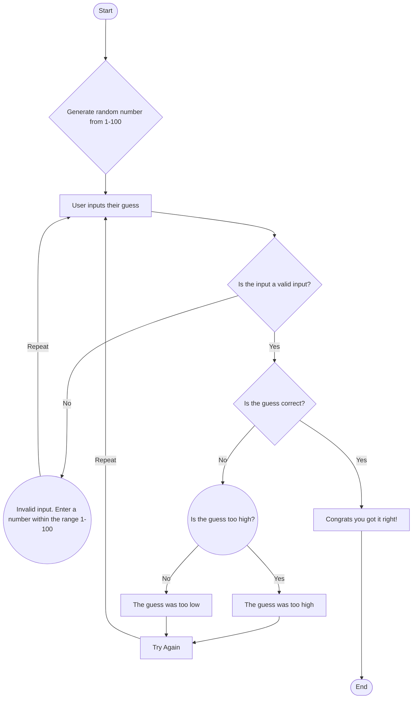

# Guessing Game

# Description
1. Step A: Starts the Game
2. Step B: The computer generates a random number between 1 to 100
3. Step C: Gets the user input
4. Step D: Checks if the user's input is valid
5. Step E: Determines the user's input is invalid and reiterates to the user to choose a number between 1 and 100. Goes back to Step C
6. Step F: Checks if the user's guess is correct.
7. Step G: The user's guess is correct. Goes to Step L
8. Step H: Checks if the user's guess was too high.
9. Step I: Determines the user's guess was too high. Goes to Step K
10. Step J: Determines the user's guess was too low. Goes to Step K
11. Step K: Lets the user guess again. Goes back to Step C
12. Step L: Ends the Game
